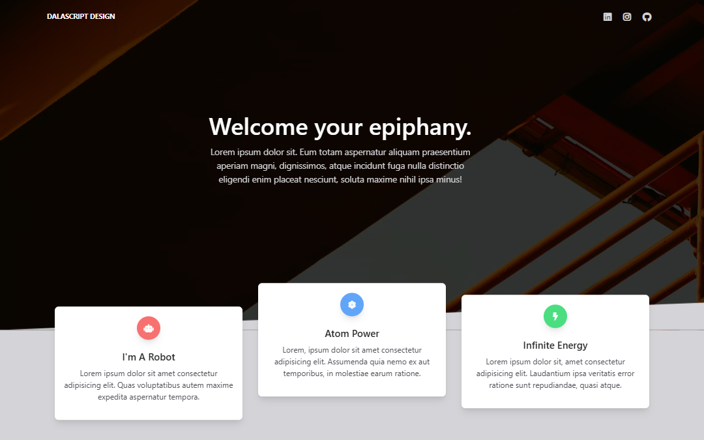

# Animated Template | ZTM JS Web Projects Course

**Project 6/20**

A sleek and animated landing page template built with Tailwind CSS and AOS.js. This modern UI design features smooth animations, responsive layouts, and an eye-catching aesthetic perfect for practicing frontend development skills.

---

## 📚 Table of Contents

- [🔎 Overview](#-overview)
  - [📸 Screenshot](#-screenshot)
  - [🔗 Links](#-links)
  - [📌 Features](#-features)
- [🧠 My process](#-my-process)
  - [🛠️ Built with](#️-built-with)
  - [🎓 What I learned](#-what-i-learned)
  - [🔜 Next Project](#-next-project)
- [👤 Author](#-author)
  - [🌐 Connect with Me](#-connect-with-me)
  - [💻 Coding Profiles](#-coding-profiles)

---

## 🔎 Overview

### 📸 Screenshot

### 🔗 Links

 - [🔴 Live Demo](https://dalascript.github.io/animated-template/)
 - [🗂️ GitHub Repository](https://github.com/DalaScript/animated-template)

### 📌 Features

 - ✅ Responsive navbar with mobile toggle functionality
 - ✅ Smooth scroll animations powered by AOS.js
 - ✅ Modular JavaScript for cleaner interactivity

## 🧠 My Process

### 🛠️ Built with

 - HTML5
 - Vanilla JavaScript
 - [AOS.js (Animate On Scroll)](https://michalsnik.github.io/aos/)
 - [Tailwind CSS](https://tailwindcss.com/)

### 🎓 What I Learned

 - How to implement and customize AOS animations

### 🔜 Next Project

 - Navigation Nation → [View Repository](https://dalascript.github.io/navigation-nation/)

---

## 👤 Author

### 🌐 Connect with Me

 - [Instagram](https://www.instagram.com/DalaScript)
 - [YouTube](https://www.youtube.com/@DalaScript)

### 💻 Coding Profiles

 - [freeCodeCamp](https://www.freecodecamp.org/DalaScript)
 - [FrontendMentor](https://www.frontendmentor.io/profile/DalaScript)
 - [GitHub](https://github.com/DalaScript)

*🙌 Thanks for checking out my project! More coming soon. Stay tuned 🚀*